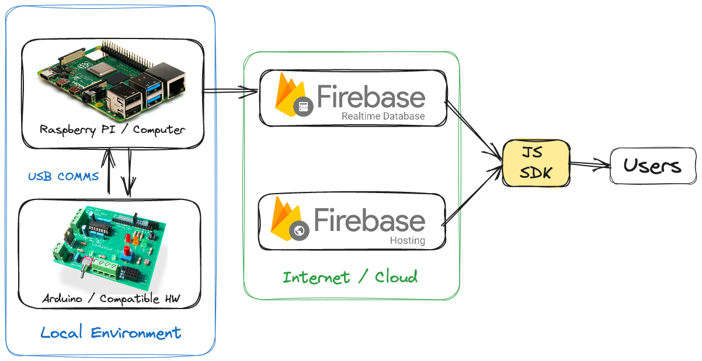
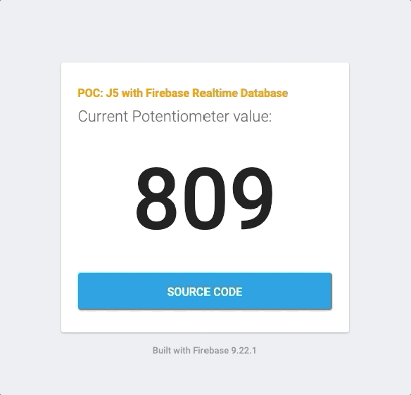

# POC - Johnny Five with Firebase Realtime DB

Proof of Concept - how to use Firebase Realtime Database with Johnny-five

### 🔮 About

This project is a proof of concept that demonstrates the potential of Firebase Realtime Database as a communication channel between a device and the cloud. It is based on the [Johnny-five](http://johnny-five.io/) library, which is a framework that enables hardware control using JavaScript.

The main goal of this POC is to showcase the use of Firebase Realtime Database and Firebase Hosting as an alternative to more complex solutions available in the market. It is a simple and extensible out-of-the-box architecture that allows you to control any device with low resources or in a very isolated environment. With the support of the Firebase Cloud, you can provide high-quality dashboards to manage the device(s).

### 📺 Tutorial

_soon_

### :shipit: Architecture

The hardware device is connected to the host machine via USB. The host machine runs a Node.js application that uses the Johnny-five library to control the device. The Node.js application is also connected to the Firebase Realtime Database and pushes changes to the database.

The website is connected to the Firebase Realtime Database and listens to changes in the database. When the website receives a new value, it updates the UI accordingly.

The website is hosted on Firebase Hosting and is available to the public.

### 🤖 Hardware

In this example, I am using the [Edubasica Shield](https://edubasica.github.io/) and Arduino Uno, but any board compatible with Johnny-five and any other shield that provides a potentiometer can be used.

For more information on compatible potentiometers, please refer to the [Johnny-five documentation](http://johnny-five.io/examples/potentiometer/).

In this example, I am using the potentiometer located in the `A0` pin.

### 🌎 Website

The website is hosted on Firebase Hosting, and it is a simple dashboard that allows you to control the potentiometer remotely. The dashboard is subscribed to the Firebase Realtime Database, and it is updated in real-time when the potentiometer is triggered.

The website is built using simple and plain JavaScript, HTML, and CSS in order to avoid any learning curve.

### 📡 Usage

This project is a proof of concept and is not intended for production use. It is not recommended to expose the Firebase Realtime Database to the public. In this example, the database is partially open to the public for demonstration purposes.

To run this project in your local environment, follow these steps:
1. Create a Firebase project from scratch, including credentials, with database and hosting enabled.
2. Copy the following files: `./package*.json`, `./arduino.js`.
3. Add the database credentials to `./serviceAccountKey.json`.
4. Use the correct Node.js version (`nvm use`).
5. Run `npm install`.
6. Connect the hardware device to your machine.
7. Run `npm start:arduino`.
8. Open the file `public/index.html` in your browser or use any other Live Server extension or similar.
